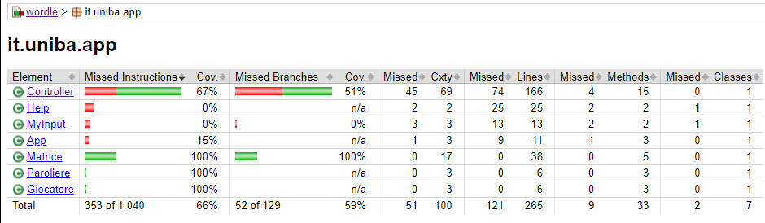
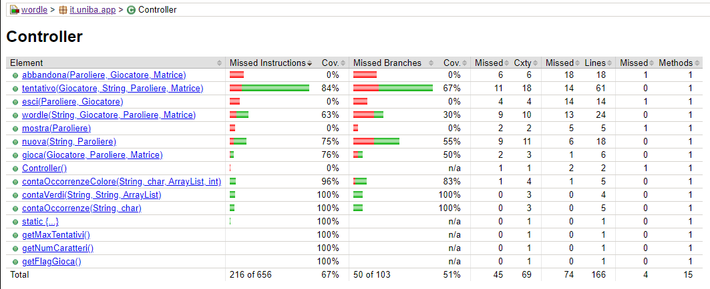
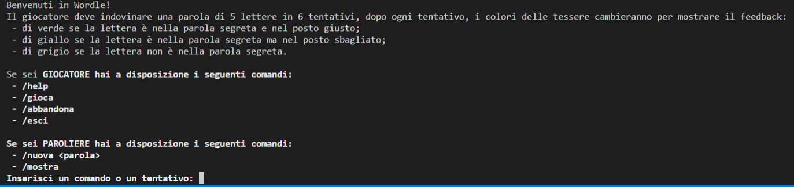
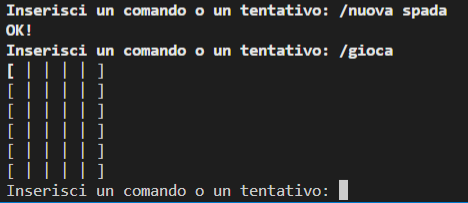
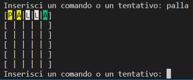
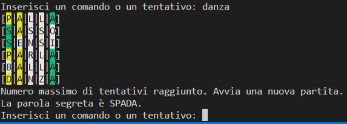
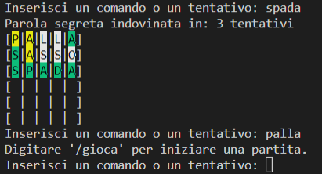
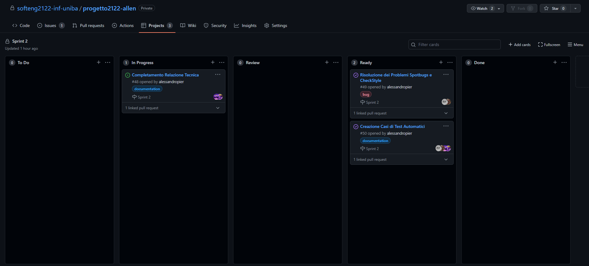

# Report

##  Indice
1. [`Introduzione`](#introduzione)

2. [`Modello di dominio`](#modello-di-dominio)

3. [`Requisiti specifici`](#requisiti-specifici)

    3.1 [`Requisiti funzionali`](#requisiti-funzionali)

    3.2 [`Requisiti non funzionali`](#requisiti-non-funzionali)

4. [`System Design`](#system-design)

    – Stile architetturale adottato (opzionale) 

    – Diagramma dei package, diagramma dei componenti (opzionali)

    – [`Commentare le decisioni prese`](#commentare-le-decisioni-prese)

5. [`OO Design`](#oo-design)

    – [`Diagramma delle classi`](#diagramma-delle-classi) 

    – [`Diagrammi di sequenza per le user story`](#diagrammi-di-sequenza-per-le-user-story)

    – Menzionare l'eventuale applicazione di design pattern (opzionale)

    – Commentare le decisioni prese (opzionale)

6. [`Riepilogo del test`](#riepilogo-del-test)

    – Riportare la tabella riassuntiva di coveralls (o jacoco), con
    dati sul numero dei casi di test e copertura del codice

7. [`Manuale utente`](#manuale-utente)

8. [`Organizzazione del lavoro e Processo di sviluppo`](#organizzazione-del-lavoro-e-processo-di-sviluppo)

9. [`Analisi retrospettiva`](#analisi-retrospettiva)

    – Cosa vi ha fatto sentire soddisfatti e vi ha reso contenti

    – Cosa vi ha fatto sentire insoddisfatti e vi ha deluso

    – Cosa vi ha fatto «impazzire» e vi ha reso disperati

---

## `Introduzione`
Il suddetto documento si pone l'obiettivo di sviscerare ed indicare con precisione tutte le componenti e specifiche relative al progetto assegnatoci dal docente di Ingegneria del Software, **Filippo Lanubile**, durante l'a.a. 2021/22 presso l'Università degli Studi di Bari.

Tale progetto viene preso in carico dal gruppo **allen** composto da:

    - Alessandro Piergiovanni (Corso B)
    - Flaviana Corallo (Corso A)
    - Nicolò Sciancalepore (Corso B)
    - Saverio de Candia (Corso A)

Worlde è un gioco online in cui un giocatore deve indovinare una **parola segreta** di 5 caratteri che viene generata casualmente ogni giorno.

Il giocatore ha a disposizione **6 tentativi** per indovinarla ottenendo degli **indizi** basandosi sui caratteri indovinati e su quelli presenti nella parola segreta ma in posizione errata, come mostrato in figura:

Per accessibilità e fattibilità di progetto si è scelto di ridurre alcune funzionalità del gioco come la **generazione casuale** della **parola segreta**. 

## `Modello di dominio`

## `Requisiti specifici`
In questa sezione si vuole definire lo **scopo del progetto**, descrivere **cosa si sta costruendo** e **specificare i requisiti**.

I **requisiti funzionali** sono rappresentati mediante elenchi di caratteristiche o **servizi che il sistema deve fornire**.

L'obiettivo è **indicare il comportamento** del sistema in seguito a **particolari input** e come dovrebbe reagire.

I **requisiti non funzionali** sono i vincoli e le proprietà relative al sistema, come **vincoli temporali**, **vincoli sugli standard adottati** e **vincoli sul processo di sviluppo**.

- ### `Requisiti funzionali`
    - RF1: Come paroliere voglio impostare una parola segreta manualmente
    - RF2: Come paroliere voglio mostrare la parola segreta
    - RF3: Come giocatore voglio mostrare l'help con elenco comandi
    - RF4: Come giocatore voglio iniziare una nuova partita
    - RF5: Come giocatore voglio abbandonare la partita
    - RF6: Come giocatore voglio chiudere il gioco
    - RF7: Come giocatore voglio effettuare un tentativo per indovinare la parola segreta
    
    **Criteri di accettazione RF1**:

        Al comando /nuova l'applicazione risponde "**OK**" se non si verificano i seguenti problemi:
        • Parola segreta troppo corta: i caratteri sono inferiori a quelli del gioco
        • Parola segreta troppo lunga: i caratteri sono superiori a quelli del gioco
        • Parola segreta non valida: ci sono caratteri che non corrispondono a lettere dell’alfabeto

    **Criteri di Accettazione RF2**:

        Al comando /mostra l’applicazione risponde visualizzando la parola segreta se essa è impostata.
    
    **Criteri di Accettazione RF3**:

        Al comando /help l'applicazione mostra come risultato una descrizione concisa, che appare anche all'avvio del programma, seguita dalla lista di comandi disponibili, uno per riga, come da esempio successivo:
        • gioca
        • esci
        • ...

    **Criteri di Accettazione RF4**:

        Al comando /gioca, se nessuna partita è in corso, l'applicazione mostra la matrice dei tentativi vuota e si predispone a ricevere il primo tentativo o altri comandi.

    **Criteri di Accettazione RF5**:
    
        Al comando /abbandona l'applicazione chiede conferma:
        • se la conferma è positiva, l'app comunica l’abbandono
        • se la conferma è negativa, l'app si predispone a ricevere un altro tentativo o altri comandi

        solo se è in corso una partita.

    **Criteri di Accettazione RF6**:

        Al comando /esci l'applicazione chiede conferma:
        • se la conferma è positiva, l'app si chiude restituendo un zero exit code
        • se la conferma è negativa, l'app si predispone a ricevere nuovi tentativi o comandi

    **Criteri di Accettazione RF7**:

        Digitando caratteri sulla tastiera e invio l’applicazione riempie la prima riga libera della matrice dei tentativi con i caratteri inseriti e colorando lo sfondo di:
        • verde se la lettera è nella parola segreta e nel posto giusto
        • giallo se la lettera è nella parola segreta ma nel posto sbagliato
        • grigio se la lettera non è nella parola segreta

        Se le lettere sono tutte verdi l’applicazione risponde
        • Parola segreta indovinata indicando anche il numero di tentativi necessari
        e si predispone a nuovi comandi

        Se il tentativo fallito è l’ultimo possibile, l’applicazione risponde:
        • Hai raggiunto il numero massimo di tentativi.
        La parola segreta è <…> e si predispone a nuovi comandi

        Se la parola segreta non è stata impostata l’applicazione risponde:
        Parola segreta mancante

        se non è presente uno di questi problemi:
        • Tentativo incompleto se i caratteri sono inferiori a quelli della parola segreta
        • Tentativo eccessivo se i caratteri sono superiori a quelli della parola segreta
        • Tentativo non valido se ci sono caratteri che non corrispondono a lettere dell’alfabeto    
    
- ### `Requisiti non funzionali`
    - RNF1: Il gioco sarà utilizzabile solo tramite linea di comando
    - RNF2: Il gioco non genera casualmente da un dizionario le parole ma saranno impostante manualmente
    - RNF3: Il gioco non prevede un limite di tempo per indovinare la parola
    - RNF4: Il gioco non permette di salvare una partita per riprendere a giocare in seguito
    - RNF5: Il gioco non permette di scegliere il numero massimo di tentativi entro cui indovinare la parola
    - RNF6: Il gioco non permette di visualizzare la tastiera a video
    - RNF7: Il gioco non permette di scegliere il numero di lettere della parola segreta
    - RNF8: Il gioco non permette di caricare una partita per ricominciare a giocare
    - RNF9: Il gioco non mostra il tempo di gioco
    - RNF10: Il sistema deve poter essere visualizzato correttamente su Windows Terminal, Git Bash e Shell Linux.
    - RNF11: il container docker dell’app deve essere eseguito da terminali che supportano Unicode con encoding UTF-8 o UTF-16

    ---
## `System Design`

### `Commentare le decisioni prese`
Il gruppo ***allen*** ha individuato i seguenti errori di checkstyle:

- 'x' is a magic number (test)
- Parameter 'x' should be final (main)

Il gruppo ha deciso di **non** correggere i suddetti errori per i **seguenti motivi**: 

- 'x' is a magic number: i magic number individuati fanno parte dei casi di test;  
- Parameter 'x' should be final: tali parametri sono stati utilizzati e quindi non si è ritenuto opportuno convertirli in final.

## `OO Design`

### `Diagramma delle classi`

La classe MyInput è stata progettata con l'obiettivo di semplificare le operazioni di input delle stringhe, affinchè la stringa rispetti i criteri definiti.

### `Diagrammi di sequenza per le user story`

- Nuova

- Gioca

- Tentativo

- Abbandona

- Esci

## `Riepilogo del test`

Non si sono effettuati dei test sulle classi **Help** e **MyInput** in quanto sono classi **Boundary**.

Le funzioni **Abbandona** ed **Esci** non sono state testate per l'impossibilità di effettuare test riguardanti le stampe a video.

Sulla funzione **Wordle** invece non sono stati effettuati tutti i casi di test in quanto alcuni di essi richiedevano l'implementazione del framework **Mockito**, che sarebbe servito per controllare l'ingresso in una funzione.

Le restanti porzioni di codice non controllate sono **stampe a video**.

## `Manuale utente`

La corrente sezione del documento ha come obiettivo quello di **documentare** e **guidare l'utente** nell'**utilizzo** del gioco **Wordle**.

Di seguito si esibisce un **tutorial dettagliato** corredato di **immagini autoesplicative**.

### Menù Iniziale 

Inizialmente, il gioco si presenta con questa schermata mostrando all'utente una sequenza di comandi che esso può impartire sulla base del suo ruolo (**Giocatore** o **Paroliere**).

Per iniziare una nuova partita è necessario che la parola segreta di **5 caratteri** sia impostata tramite il comando "**/nuova < parola >**".

Per effettuare un tentativo è necessario che sia in corso una partita con il comando "**/gioca**".

Di seguito il gioco rimane in attesa di un comando o di un tentativo da parte dell'utente.

### Gioco

Dopo aver impostato la parola segreta, il giocatore è libero di iniziare la partita mediante il comando "**/gioca**" stampando la matrice dei tentativi vuota. 

La **matrice dei tentativi** viene **popolata** e **ristampata** a video ad ogni tentativo in modo da mantenere una **storia visiva** dei tentativi.

#### Tentativo Errato:

Ad ogni **tentativo errato** viene mostrata la matrice dei tentativi **aggiornata** che, mediante i colori del background, mostra all'utente se un carattare è in **posizione corretta** (verde), è in **posizione errata** ma presente (giallo) o **non è presente** nella parola segreta (grigio).

Se il **giocatore** raggiunge il numero **massimo** di **tentativi** (6) viene stampata a video la matrice dei tentativi e viene informato l'utente che ha **raggiunto** il **massimo dei tentativi** e dovrà **avviare** una **nuova partita**.

Di seguito viene **stampata** a video la **parola segreta**.

#### Tentativo Corretto

Se il **giocatore** fornisce un **tentativo corretto**, viene stampata la matrice dei tentativi aggiornata con **verde** come **background color** e si informa l'utente di aver **indovinato** la **parola segreta** fornendo anche il numero di **tentativi impiegati**.

Il **paroliere** dovrà reimpostare la parola segreta con **"/nuova < parola >**" per permettere al **giocatore** di iniziare una **nuova partita** con il comando "**/gioca**".

## Altre Funzionalità

### Help

Il **giocatore** può visionare la **lista** dei **comandi** mediante il comando "**/help**".

### Abbandona 

Il **giocatore** può **abbandonare** la **partita corrente** con il comando "**/abbandona**", di seguito può iniziarne un'altra con "**/gioca**" dopo che il **paroliere** ha **impostato** la **parola segreta**.

### Esci

Il **giocatore** può chiudere il gioco utilizzando il comando "**/esci**".

### Mostra

Il **paroliere** può utilizzare il comando "**/mostra**" per **stampare** a video la **parola segreta** da lui impostata.

## `Organizzazione del lavoro e Processo di sviluppo`

### Organizzazione del Lavoro

Il gruppo "**allen**" composto da **2 membri** per **corso** (A e B) si è riunito in data **08/03/22** per effettuare la **conoscenza** dei **membri** del **gruppo**.

I **componenti** del suddetto si sono **accordati** per utilizzare **discord** per le **riunioni** e **telegram** come **app di messaggistica ufficiale** per le **comunicazioni** e gli **avvisi**.

I **compiti** sono stati **equamente suddivisi** tra i membri, inizialmente favorendo un **lavoro di gruppo** per poi prediligere il **lavoro individuale** con successiva **discussione**, **modifica** e **approvazione** da parte degli altri componenti del gruppo. 

### Processo di Sviluppo

Il **processo di sviluppo** software si è articolato in **diverse fasi** che hanno **coinvolto** tutti i **membri** del **gruppo**.

Ciascuna **funzionalità** è stata **realizzata** seguendo lo **schema** mostrato di seguito:

- Analisi del Problema
- Lista delle Funzionalità da Garantire
- Ideazione della Soluzione
- Progettazione
- Realizzazione del Codice
- Testing della Funzionalità

Di seguito viene fornito un **esempio** di **processo di sviluppo** prendendo ad esempio la **realizzazione** della funzione **Tentativo**.

Facendo fede alle prime due fase, il **gruppo** si **riunisce** per **decidere** le **azioni** da **intraprendere** e stila una **lista** delle **funzionalità** che la funzione **Tentativo** deve garantire.

Di seguito, si **procede** con **l'ideazione** della **soluzione** e la **progettazione** della soluzione seguita dalla **realizzazione del codice**.

La fase di **progettazione** ha portato alla **realizzazione** della funzione **tentativo** che si basa sul seguente **algoritmo**:

    Innanzitutto, si procede con il controllo di validità del tentativo inserito dal giocatore.

    Se il controllo di validità della parola non va a buon fine, l'utente viene informato dell'errore e viene richiesto il reinserimento altrimenti si prosegue.

    Se la parola inserita dal giocatore coincide con la parola segreta si informa l'utente di aver indovinato stampando stampa la matrice dei tentativi e resettando tutte le variabili relative al gioco per permettere al giocatore di iniziare una nuova partita. 

    Se la parola inserita non coincide con la parola segreta si procede con il controllo delle lettere secondo le regole di Wordle. 

La realizzazione della **porzione** di **funzione** che si occupa di **controllare** i **caratteri** delle parole e la loro **posizione** si basa sul seguente **algoritmo**:

    Facendo riferimento alla parola segreta, si utilizza un array ausiliare "esito" per memorizzare il colore che ogni carattere della parola inserita dal giocatore dovrà assumere secondo questa legenda:
        - 1: verde (carattere in posizione corretta)
        - 0: giallo (carattere presente ma in posizione sbagliata)
        - 2: grigio (carattere non presente)
    Per prima cosa si controlla i caratteri che si trovano in posizione corretta. 
    Laddove il carattere in posizione x della parola segreta, impostata dal paroliere, dovesse corrispondere con il carattere in posizione x della parola inserita dal giocatore allora si inserirebbe il valore "1" nella cella corrispondente al carattere. 

    In seguito si esegue un ciclo for su tutta la lunghezza della parola (5 in questo caso) e si svolge il corpo se e solo se il numero presente nella cella corrente del vettore "esito" è diverso da 1, quindi se quel carattere non è in posizione corretta rispetto alla parola segreta potendo assumere o il colore giallo o il colore grigio.

Se il **valore** all'interno della **cella** di **esito** è **diverso** da **1** allora **si esegue l'if** la cui **condizione** è una semplice **sottrazione** ideata come segue:

    Dato il carattere da controllare, si conta il numero di occorrenze totali nella parola segreta e si sottrae la somma tra il numero di occorrenze in posizione giusta (con esito = 1) e il numero di occorrenze in posizione errata nella parola del giocatore ma presente nella parola segreta (con esito = 0).

    Se il numero ottenuto è maggiore di 0 allora siamo sicuri che il carattere che stiamo considerando è presente nella parola segreta ma non è in posizione corretta, pertanto è corretto impostare il colore a giallo (con esito = 0).

    Così facendo siamo sicuri che, in presenza di "x" caratteri uguali nella parola dell'utente e di "k" (con k < x) caratteri uguali nella parola segreta, ad essere impostati a giallo saranno solo i primi "k" caratteri e non gli altri in maniera da fornire una giusta e precisa informazione al giocatore.

    Per concludere si aggiorna il numero di tentativi, la matrice ed il colore delle singole celle con relativa stampa a video.

Infine si procede con la **fase di testing** delle **funzionalità** e **validazione** del **lavoro svolto**.

### **Scrum Framework**

Per lo sviluppo del progetto **Wordle**, il gruppo **allen** è ricorso all'utilizzo di un approccio agile per lo sviluppo del software.

In particolare ci si è affidati al **framework Scrum**, che utilizza un **processo** di sviluppo **iterativo** che si articola in **diversi Sprint**, permettendo un deployment costante del software e un feedback frequente.

Il progetto **Wordle** è stato suddiviso in **3 Sprint**:

    1. Sprint 0: Dimostrare familiarità con GitHub, Git e il processo agile.
    2. Sprint 1: Giocare in modo basico
    3. Sprint 2: Assicurare la qualità del lavoro svolto.

Ogni sprint è **durato** complessivamente circa **2 settimane**; in questo periodo il gruppo ha analizzato, progettato, implementato e testato i requisiti funzionali corrispondenti alle **user stories** del **Product Owner**. 

Il **Product Owner** è il **responsabile** del **valore del prodotto** che si occupa di **accettare** o **rifiutare** i **risultati** del lavoro **del team** di sviluppo e di **decidere data** e **contenuto** di una **release**. 

Inizalmente è stato stilato il **Product Backlog** di progetto che **raccoglie** tutte le **richieste del cliente** che il gruppo dovrà sviluppare durante gli sprint.

Il **Product Backlog** è composto da varie **User Stories**, rappresentanti i requisiti funzionali del software e le features che il cliente si aspetta.

Di seguito si riporta il **Product Backlog** del progetto **Wordle**:

    Attori: Giocatore e Paroliere

    Le seguenti user story inizierebbero con "Come paroliere voglio <azione>"
        - impostare una parola segreta manualmente
        - scegliere casualmente una parola segreta da utilizzare nella sessione di gioco
        - mostrare la parola segreta
        - mostrare la frequenza dei tentativi (x 1 tentativo, ..., y 6 tentativi, z fallimenti) nella sessione di gioco
        - impostare il tempo di gioco
        - scegliere la lingua con cui giocare
        - scegliere il numero di tentativi massimo
        - scegliere il numero di lettere della parola segreta

    Le seguenti story inizierebbero con "Come giocatore voglio <azione>"
        - mostrare l'help con elenco comandi e regole del gioco
        - mostrare la lingua con cui giocare
        - iniziare una nuova partita
        - abbandonare una partita
        - salvare una partita per riprendere a giocare in seguito
        - caricare una partita per ricominciare a giocare
        - effettuare un tentativo per indovinare la parola segreta
        - mostrare la tastiera con le lettere colorate
        - chiudere il gioco
        - mostrare il tempo di gioco

Di seguito, per ogni **Sprint** è stato definito uno **Sprint Backlog**, rappresentante un set di tutte le **User Stories** che il **Product Owner** ha ritenuto di **maggior priorità** con l'obbiettivo di svilupparle nel periodo di **tempo delimitato** dallo **Sprint** (2 settimane per Sprint). 

Di seguito, viene riportato un **esempio** di Sprint Backlog, relativo allo **Sprint 1**:

### **Sprint 1 Backlog**

    Obiettivo: Giocare in modo basico

    Product backlog: 
    
    Attori: Giocatore e Paroliere

    Le seguenti user story inizierebbero con come paroliere voglio:

    - Impostare una parola segreta manualmente
    - Mostrare la parola segreta

    Le seguenti story inizierebbero con come giocatore voglio:

    - Mostrare l'help con elenco comandi e regole del gioco
    - Iniziare una nuova partita
    - Abbandonare una partita
    - Effettuare un tentativo per indovinare la parola segreta
    - Chiudere il gioco

    E' stata abbozzata la relazione tecnica:

    Formato: Markdown 
    Dove: nel repository /docs/ 
    Nome file: Report.md 
    Sezioni: 

        1. Introduzione 
        2. Modello di dominio 
        3. Requisiti specifici 
            3.1 Requisiti funzionali 
            3.2 Requisiti non funzionali 
        5. OO Design (diagrammi delle classi e diagrammi di sequenza delle user story più importanti con eventuali commenti alle decisioni prese).

    Criteri che devono essere soddisfatti per qualsiasi user story:

    - C'è un issue con label «user story»
    - La issue è in un Milestone e in una Project Board
    - Assegnazione a uno o al più due componenti del team
    - Ogni classe è preceduta da un commento che riassume la responsabilità della classe
    - Ogni classe è preceduta da un commento per indicare se è di tipo <>, <>, <>, <>
    - I commenti iniziano con /** e terminano con with */
    - I commit devono avere una descrizione breve ma significativa
    - C'è una Pull Request (PR) che corrisponde alla user story
    - La PR è in un Milestone ma non in una Project Board
    - C'è un commento che linka la PR all'issue (es. "closes #22")
    - La PR è accettata a review avvenuto ed esplicito
    - Build costruito con successo
    - Docker image caricata con successo
    - L'esecuzione rispetta i criteri di accettazione

Altro strumento utilizzato dal gruppo **allen** durante il **processo di sviluppo software** è stata la **Scrum Board**, che consiste in una **lavagna** utilizzata per **organizzare le User Stories** relative allo Sprint di riferimento.

### **Esempio di Project Board:** Sprint 1

La **Project Board** è stata divisa in **5 sezioni**, che rappresentano le **5 fasi** in cui le issue possono trovarsi.
Queste sezioni sono:

    - To Do: issue ancora da iniziare;
    - In Progress: issue in corso di svolgimento;
    - Review: issue in attesa di revisione da parte dei membri del team;
    - Ready: issue approvata dai membri del team e in attesa di revisione da parte del Product Owner;
    - Done: issue completato con successo dopo l'approvazione del Product Owner.

### **Sprint review**
Per ogni sprint, è stata effettuata una **riunione** tra i **membri del team di sviluppo** e il **Product Owner**, che fornisce un **feedback** al team di sviluppo sul lavoro svolto durante lo sprint appena concluso. 

Successivamente **si discute su problemi** eventualmente riscontrati e si procede quindi a **risolverli**.
  

### **Sprint planning**
All'inizio del progetto si è stilata una **lista** di tutte le possibili **user story** riguardanti il **progetto**. 

Effettuata la loro definizione, **per ogni sprint** si procede con la **selezione e lo sviluppo** di una parte delle user story, **raggiungendo l'obiettivo** prefissatosi prima dello sprint.
  

### **Daily scrum meeting**
Il **team** ha svolto **riunioni giornaliere** per aggiornarsi sul **progresso** del lavoro svolto, utili ai componenti del gruppo per un **confronto** riguardante **eventuali problematiche** riscontrate, cercando un'eventuale **soluzione**. 

In seguito, il gruppo ha svolto, **per ogni sprint**, una discussione mirata all'**organizzazione e alla distribuzione equa** del lavoro da svolgere.
  

### **Sprint Retrospective**
Il gruppo ha effettuato un'**analisi retrospettiva**, ovvero una riunione basata sul metodo scientifico dalla durata di 15-30 minuti a cui **partecipa tutto il team**. 

In tale riunione si discute: 

    - cosa introdurre 
    - cosa evitare
    - cosa continuare

nel prossimo sprint.

Inoltre si specifica anche cosa ha fatto sentire:

    - contento
    - deluso
    - disperato

nello sprint concluso, secondo la metodologia **Mad, Sad, Glad**.

## `Analisi Retrospettiva`

### Sprint 1

