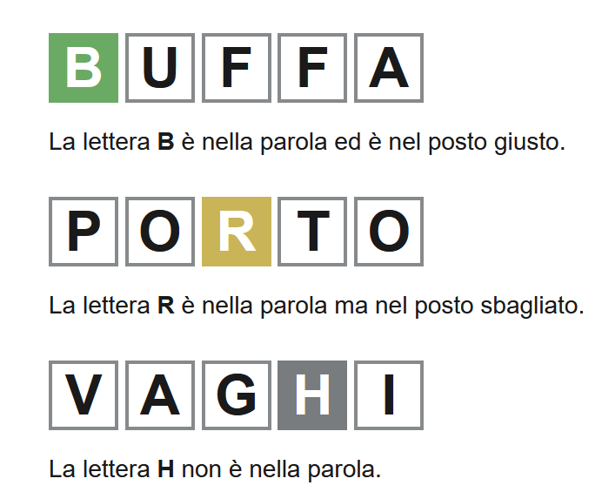
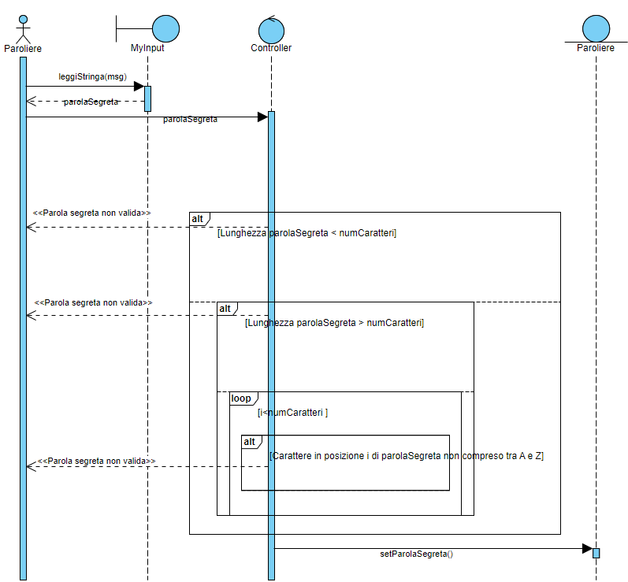
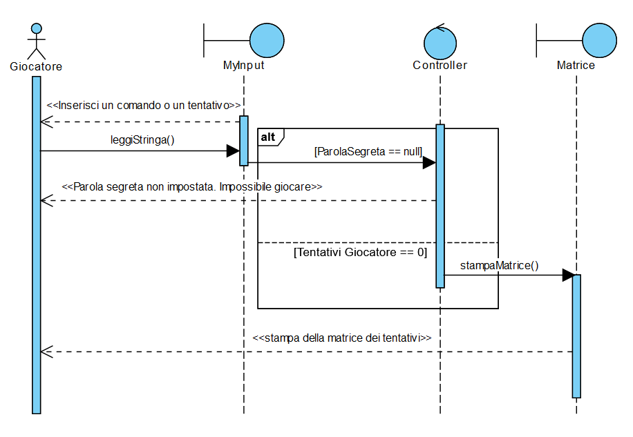
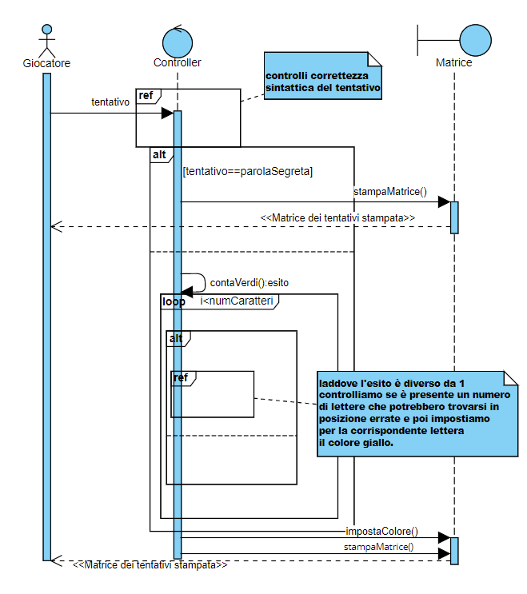
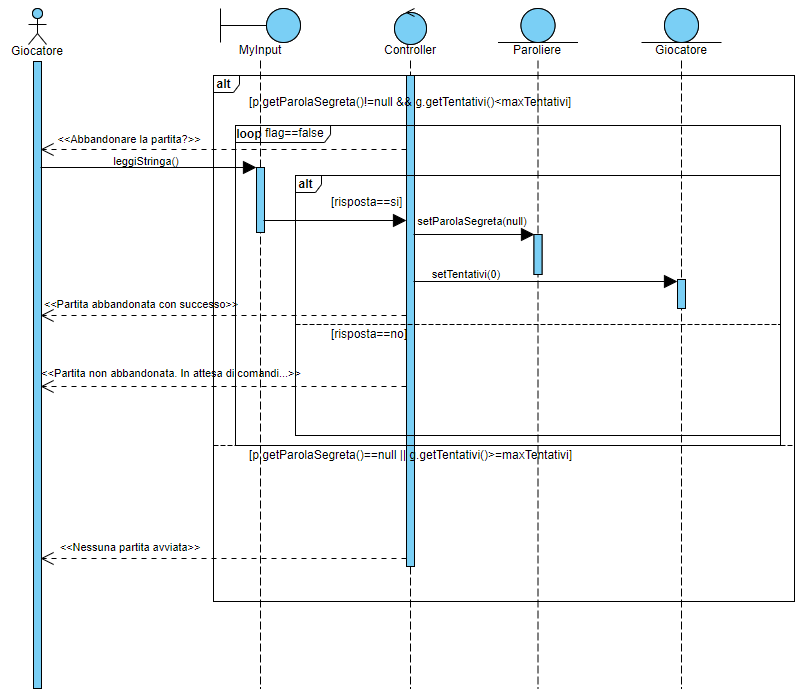
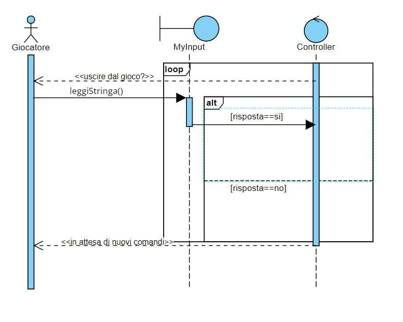
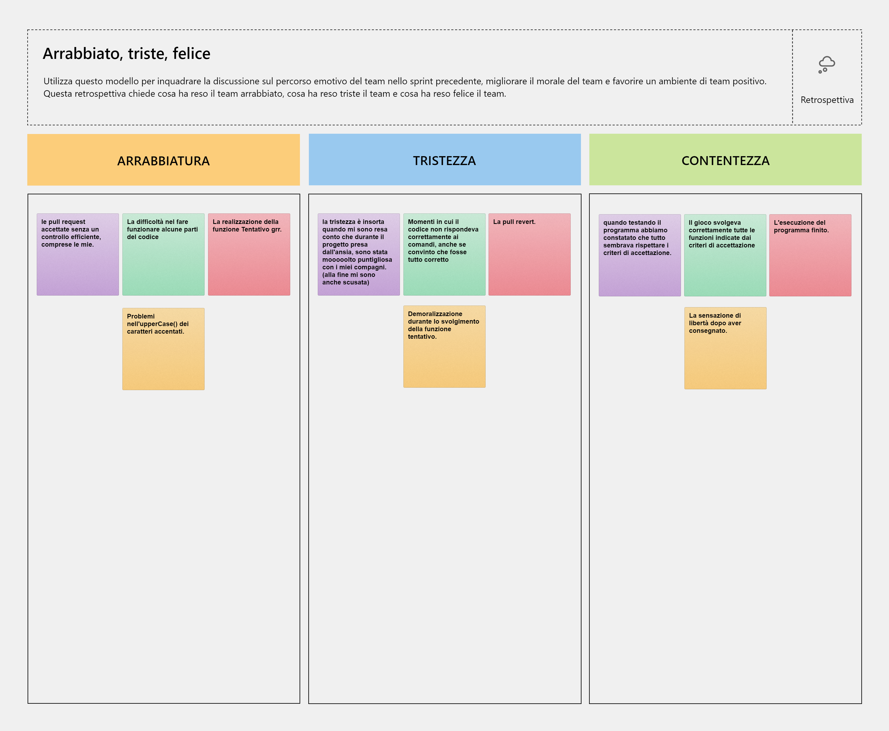

# Report

##  Indice
1. [`Introduzione`](#introduzione)

2. [`Modello di dominio`](#modello-di-dominio)

3. [`Requisiti specifici`](#requisiti-specifici)

    3.1 [`Requisiti funzionali`](#requisiti-funzionali)

    3.2 [`Requisiti non funzionali`](#requisiti-non-funzionali)

4. [`System Design`](#system-design)

    – Stile architetturale adottato (opzionale) 

    – Diagramma dei package, diagramma dei componenti (opzionali)

    – Commentare le decisioni prese (opzionale)

5. [`OO Design`](#oo-design)

    – [`Diagramma delle classi`](#diagramma-delle-classi) 

    – [`Diagrammi di sequenza per le user story`](#diagrammi-di-sequenza-per-le-user-story)

    – Menzionare l'eventuale applicazione di design pattern (opzionale)

    – Commentare le decisioni prese (opzionale)

6. [`Riepilogo del test`](#riepilogo-del-test)

    – Riportare la tabella riassuntiva di coveralls (o jacoco), con
    dati sul numero dei casi di test e copertura del codice

7. [`Manuale utente`](#manuale-utente)

8. [`Processo di sviluppo e organizzazione del lavoro`](#processo-di-sviluppo-e-organizzazione-del-lavoro)

9. [`Analisi retrospettiva`](#analisi-retrospettiva)

    – Cosa vi ha fatto sentire soddisfatti e vi ha reso contenti

    – Cosa vi ha fatto sentire insoddisfatti e vi ha deluso

    – Cosa vi ha fatto «impazzire» e vi ha reso disperati

---

## `Introduzione`
Il suddetto documento si pone l'obiettivo di sviscerare ed indicare con precisione tutte le componenti e specifiche relative al progetto assegnatoci dal docente di Ingegneria del Software, **Filippo Lanubile**, durante l'a.a. 2021/22 presso l'Università degli Studi di Bari.

Tale progetto viene preso in carico dal gruppo **allen** composto da:

    - Alessandro Piergiovanni (Corso B)
    - Flaviana Corallo (Corso A)
    - Nicolò Sciancalepore (Corso B)
    - Saverio de Candia (Corso A)

Worlde è un gioco online in cui un giocatore deve indovinare una **parola segreta** di 5 caratteri che viene generata casualmente ogni giorno.

Il giocatore ha a disposizione **6 tentativi** per indovinarla ottenendo degli **indizi** basandosi sui caratteri indovinati e su quelli presenti nella parola segreta ma in posizione errata, come mostrato in figura:

Per accessibilità e fattibilità di progetto si è scelto di ridurre alcune funzionalità del gioco come la **generazione casuale** della **parola segreta**. 

## `Modello di dominio`

## `Requisiti specifici`
In questa sezione si vuole definire lo **scopo del progetto**, descrivere **cosa si sta costruendo** e **specificare i requisiti**.

I **requisiti funzionali** sono rappresentati mediante elenchi di caratteristiche o **servizi che il sistema deve fornire**.

L'obiettivo è **indicare il comportamento** del sistema in seguito a **particolari input** e come dovrebbe reagire.

I **requisiti non funzionali** sono i vincoli e le proprietà relative al sistema, come **vincoli temporali**, **vincoli sugli standard adottati** e **vincoli sul processo di sviluppo**.

- ### `Requisiti funzionali`
    - RF1: Come paroliere voglio impostare una parola segreta manualmente
    - RF2: Come paroliere voglio mostrare la parola segreta
    - RF3: Come giocatore voglio mostrare l'help con elenco comandi
    - RF4: Come giocatore voglio iniziare una nuova partita
    - RF5: Come giocatore voglio abbandonare la partita
    - RF6: Come giocatore voglio chiudere il gioco
    - RF7: Come giocatore voglio effettuare un tentativo per indovinare la parola segreta
    
    **Criteri di accettazione RF1**:

        Al comando /nuova l'applicazione risponde "**OK**" se non si verificano i seguenti problemi:
        • Parola segreta troppo corta: i caratteri sono inferiori a quelli del gioco
        • Parola segreta troppo lunga: i caratteri sono superiori a quelli del gioco
        • Parola segreta non valida: ci sono caratteri che non corrispondono a lettere dell’alfabeto

    **Criteri di Accettazione RF2**:

        Al comando /mostra l’applicazione risponde visualizzando la parola segreta se essa è impostata.
    
    **Criteri di Accettazione RF3**:

        Al comando /help l'applicazione mostra come risultato una descrizione concisa, che appare anche all'avvio del programma, seguita dalla lista di comandi disponibili, uno per riga, come da esempio successivo:
        • gioca
        • esci
        • ...

    **Criteri di Accettazione RF4**:

        Al comando /gioca, se nessuna partita è in corso, l'applicazione mostra la matrice dei tentativi vuota e si predispone a ricevere il primo tentativo o altri comandi.

    **Criteri di Accettazione RF5**:
    
        Al comando /abbandona l'applicazione chiede conferma:
        • se la conferma è positiva, l'app comunica l’abbandono
        • se la conferma è negativa, l'app si predispone a ricevere un altro tentativo o altri comandi

        solo se è in corso una partita.

    **Criteri di Accettazione RF6**:

        Al comando /esci l'applicazione chiede conferma:
        • se la conferma è positiva, l'app si chiude restituendo un zero exit code
        • se la conferma è negativa, l'app si predispone a ricevere nuovi tentativi o comandi

    **Criteri di Accettazione RF7**:

        Digitando caratteri sulla tastiera e invio l’applicazione riempie la prima riga libera della matrice dei tentativi con i caratteri inseriti e colorando lo sfondo di:
        • verde se la lettera è nella parola segreta e nel posto giusto
        • giallo se la lettera è nella parola segreta ma nel posto sbagliato
        • grigio se la lettera non è nella parola segreta

        Se le lettere sono tutte verdi l’applicazione risponde
        • Parola segreta indovinata indicando anche il numero di tentativi necessari
        e si predispone a nuovi comandi

        Se il tentativo fallito è l’ultimo possibile, l’applicazione risponde:
        • Hai raggiunto il numero massimo di tentativi.
        La parola segreta è <…> e si predispone a nuovi comandi

        Se la parola segreta non è stata impostata l’applicazione risponde:
        Parola segreta mancante

        se non è presente uno di questi problemi:
        • Tentativo incompleto se i caratteri sono inferiori a quelli della parola segreta
        • Tentativo eccessivo se i caratteri sono superiori a quelli della parola segreta
        • Tentativo non valido se ci sono caratteri che non corrispondono a lettere dell’alfabeto    
    
- ### `Requisiti non funzionali`
    - RNF1: Il gioco sarà utilizzabile solo tramite linea di comando
    - RNF2: Il gioco non genera casualmente da un dizionario le parole ma saranno impostante manualmente
    - RNF3: Il gioco non prevede un limite di tempo per indovinare la parola
    - RNF4: Il gioco non permette di salvare una partita per riprendere a giocare in seguito
    - RNF5: Il gioco non permette di scegliere il numero massimo di tentativi entro cui indovinare la parola
    - RNF6: Il gioco non permette di visualizzare la tastiera a video
    - RNF7: Il gioco non permette di scegliere il numero di lettere della parola segreta
    - RNF8: Il gioco non permette di caricare una partita per ricominciare a giocare
    - RNF9: Il gioco non mostra il tempo di gioco
    - RNF10: Il sistema deve poter essere visualizzato correttamente su Windows Terminal, Git Bash e Shell Linux.
    - RNF11: il container docker dell’app deve essere eseguito da terminali che supportano Unicode con encoding UTF-8 o UTF-16

    ---

## `OO Design`

### `Diagramma delle classi`

La classe MyInput è stata progettata con l'obiettivo di semplificare le operazioni di input delle stringhe, affinchè la stringa rispetti i criteri definiti.

### `Diagrammi di sequenza per le user story`

- Nuova

- Gioca

- Tentativo

- Abbandona

- Esci

## `Analisi Retrospettiva`

### Sprint 1

